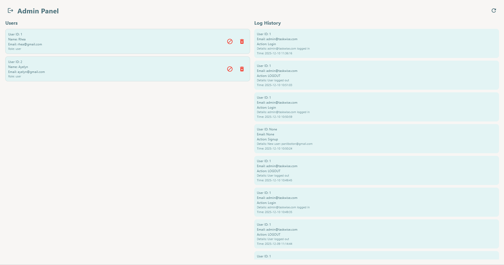
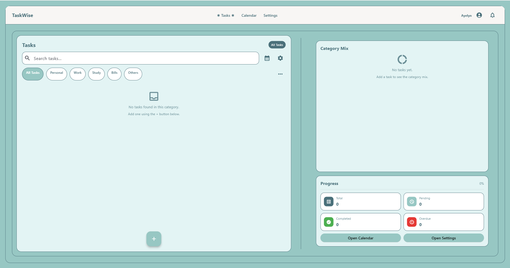
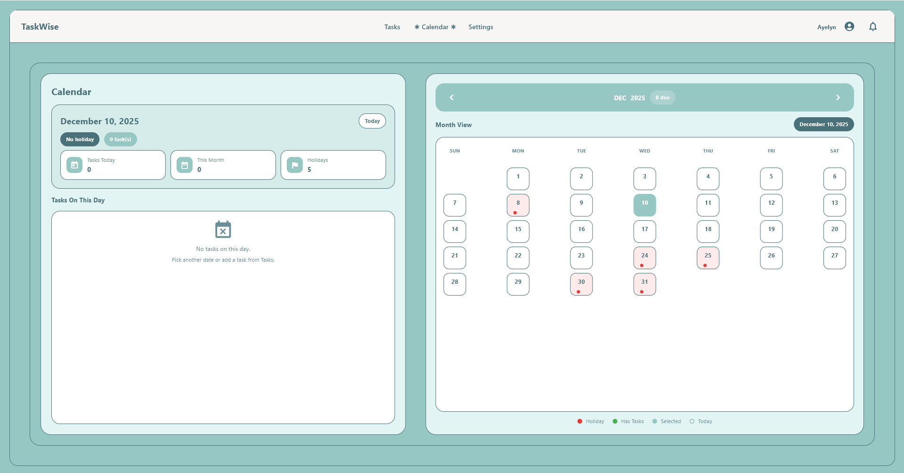
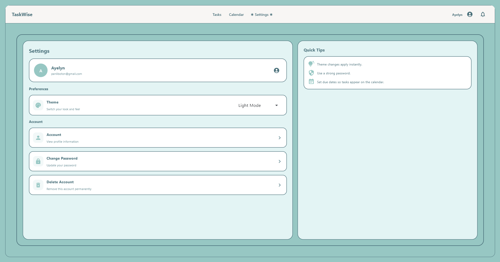
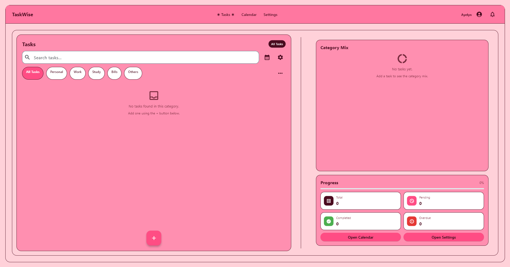

# TaskWise: Smart Task Organizer

TaskWise is a web-based task organizer built with **Flet** and **SQLite**. It lets users create tasks with due dates and times, organize tasks by category, mark tasks as completed, search and filter tasks, view tasks on a calendar, manage app settings, contact admins, and view a **24-hour notifications list** for pending tasks that are overdue or due within the next 24 hours.

---

## Team

**Due-It Squad (Muit, Panliboton, Sanglay)**  
Version: **2.0**  
Date: **October 9, 2025**

---

## Documentation Deliverables Checklist (Included In This README)

- Project Overview & Problem Statement
- Feature List & Scope Table (In/Out)
- Architecture Diagram (Text Block Diagram)
- Data Model (ERD Summary + Table Fields)
- Emerging Tech Explanation (Flet)
- Setup & Run Instructions (Dependencies + platform targets)
- Testing Summary (How to run tests)
- Team Roles & Contribution Matrix (Template included)
- Risk / Constraint Notes & Future Enhancements
- Individual Reflection (Template included)

---

## 1) Project Overview & Problem Statement

**Problem:** Students and busy users struggle to track tasks across categories, deadlines, and multiple devices. Many task lists do not show what is due soon, do not make it easy to filter/search quickly, and do not provide a clear view of progress.

**Solution:** TaskWise provides a simple dashboard for creating tasks, tracking completion, filtering/searching, viewing deadlines on a calendar, and checking a 24-hour notification list for tasks due soon or overdue. Tasks are linked to a user account so the same tasks can be accessed after login.

---

## 2) Feature List & Scope Table (What’s In / Out)

### Core Features (In Scope)
- **User Account Login** (email + password)
- **Task CRUD**
  - Add, edit, delete tasks
  - Task fields: title, description, category, due date/time, status
- **Completion Tracking**
  - Pending/Completed status using checkbox
  - Progress summary
- **Categories**
  - Filter tasks by category (Personal, Work, Study, Others, Bills)
- **Search**
  - Real-time search by title/description
- **Sorting & Reordering**
  - Sort by Title, Due Date, Date Created
  - Drag-and-drop custom order
- **Calendar**
  - View tasks by due dates
- **Notifications (Next 24 Hours)**
  - In-app notifications list showing pending tasks that are overdue or due within 24 hours
  - Bell badge count
- **Settings**
  - Saved settings per user
- **Admin Contact**
  - Admin email list (active/inactive)
- **System Logs**
  - Store actions with timestamps and optional user info

### Out of Scope (Not Included)
- Course registration, grades, or school system integration
- Real browser push notifications without the app being open (only in-app notification list unless implemented separately)
- Chat/messaging inside the app
- File attachments inside tasks
- Team collaboration or shared task lists (v1.0 is per-user)

---

## 3) Architecture Diagram (Simple Block Diagram)

```text
+------------------+        +------------------------+
|     Flet UI      | <----> |     AppState (state)   |
| (Task/Calendar/  |        | - current_view         |
|  Settings Pages) |        | - current_filter       |
+------------------+        | - theme/colors         |
         |                  | - logged-in user       |
         v                  +------------------------+
+------------------+                 |
|   App Logic      |                 v
| taskwise/app.py  |        +------------------------+
| - routing header | <----> |      db.py (SQLite)    |
| - notifications  |        | - users                |
+------------------+        | - tasks                |
                            | - settings             |
                            | - admin_contacts       |
                            | - logs                 |
                            +------------------------+
```

**System Architecture**
```
TaskWise/
│
├── main.py
├── admin.py
├── contact_admin.py
├── vault.py
├── db.py
├── .env
│
├── assets/
│
├── taskwise/
│   │
│   ├── __init__.py
│   ├── app.py
│   ├── app_state.py
│   ├── theme.py
│   │
│   └── pages/
│       ├── __init__.py
│       ├── task_page.py
│       ├── calendar_page.py
│       └── settings_page.py
│
└── README.md
```

---

## 4) Data Model  

### ERD Summary (Tables)
- **users**
- **tasks**
- **settings**
- **admin_contacts**
- **logs**

### Table Fields 
**users**
- `id` (PK)
- `username`
- `name`
- `email`
- `password_hash`
- `role` (user/admin)
- `created_at`
- `updated_at`

**tasks**
- `id` (PK)
- `user_id` (FK → users.id)
- `title` (NOT NULL)
- `description`
- `category`
- `due_text` (stores date/time text)
- `status` (NOT NULL; pending/completed)
- `created_at`
- `updated_at`

**settings**
- `id` (PK)
- `user_id` (FK → users.id)
- `setting_key` (NOT NULL)
- `setting_value` (NOT NULL)
- `updated_at`

**admin_contacts**
- `id` (PK)
- `name`
- `email` (NOT NULL)
- `active` (NOT NULL boolean)

**logs**
- `id` (PK)
- `user_id` (nullable FK → users.id)
- `action` (NOT NULL)
- `details`
- `timestamp` (NOT NULL)

---


## 5) Emerging Tech Explanation 

**Chosen Technology:** **Flet**

**Why chosen:**
- Builds UI quickly using Python
- Clean, responsive layout controls (Row/Column/ListView/Dialog)
- Works well for a dashboard-style task system

**How integrated:**
- UI pages are inside `taskwise/pages/`
- App shell and routing are handled in `taskwise/app.py`
- Data is stored and retrieved using `db.py`

**Limitations:**
- In-app notifications list works while the app runs
- True OS/browser push notifications may require extra services/APIs

---

## 6) Setup & Run Instructions

### Requirements
- Python installed (3.x)
- Internet connection (for normal app usage and repo sync)

### Install Dependencies
From the project root folder:
```bash
pip install -r requirements.txt
```

### Run the App
```bash
python main.py
```

If your environment uses Flet runner:
```bash
flet run main.py
```

### Platform Targets
- Desktop (Windows/macOS/Linux) via Python + Flet
- Web/browser (if your deployment setup supports it)

### Screenshot of our Interface
#### Admin View
- Front Page


**Admnin View**
- Screenshots of the admin side of TaskWise where the admin can manage users (view, ban/unban, delete) and review system logs.



**User View**
- Screenshots of the user side of TaskWise where users can create, edit, delete, search, categorize, and complete tasks, plus view tasks on the calendar and manage settings.


**Task Page**

**Calendar Page**

**Settings Page**


Screenshots showing TaskWise themes (Light Mode, Dark Mode, and Pink) so users can see how the app looks and feels in each style.

**Light Mode**


**Dark Mode**


**Pink Mode**

---

## 7) Due Date/Time Format (Important)

The app stores due date/time as text (`due_text`) and supports:
- `YYYY-MM-DD`
- `YYYY-MM-DD HH:MM` (24-hour)
- `YYYY-MM-DD hh:MM AM/PM` (12-hour)

The UI is designed to display time in **12-hour format with AM/PM**.

---

## 8) 24-Hour Notifications (What It Means In This App)

**24-Hour Notification** in TaskWise is an **in-app notification list** opened by the bell icon.

It shows:
- Pending tasks that are **overdue**, OR
- Pending tasks due **within the next 24 hours**

It does not show:
- Completed tasks
- Tasks with no valid due date/time

---

## 9) Testing Summary

### Where tests are located
- `taskwise/pages/test_task_page.py`
- `taskwise/pages/test_calendar_page.py`
- `taskwise/pages/test_settings_page.py`


## 10) GitHub Workflow (Commit Properly)

### Check status
```bash
git status
```

### Stage files
Stage all changed files:
```bash
git add .
```

Or stage specific files:
```bash
git add db.py taskwise/app.py taskwise/pages/settings_page.py taskwise/pages/task_page.py
```

### Commit
```bash
git commit -m "Fix due time format and 24-hour notification parsing"
```

### Push
```bash
git push origin main
```

## 11) Team Roles & Contribution Matrix (Fill This In)

| Member | Role | Main Contributions |
|--------|------|-------------------|
| Muit | (Backend/DB) | (User Data Isolation, Database, Secret Config) |
| Panliboton | (UI/UX) | (UI/UX Enhancements, Emerging Technologies) |
| Sanglay | (Documentation/QA) | (SRS, README, Validation) |

---

## 12) Risks / Constraints & Future Enhancements

### Constraints
- Must work on major browsers (if deployed for web)
- User data should be protected (hashed passwords, secure storage)
- Notifications depend on valid due date/time and active app session

### Risks
- Due date/time parsing issues if users store inconsistent formats
- Timezone differences if used across devices in different regions
- Database file handling when moving between devices

### Future Enhancements
- Real push notifications (system/browser)
- Task attachments
- Shared tasks / group projects
- Recurring tasks
- Export reports (PDF/CSV) inside UI

---

## 13) Individual Reflection (Template: 150–200 words each)

**Panliboton, Ayelyn Janne F.**  
I worked on the UI of our TaskWise app by building and improving the main screens like Tasks, Calendar, and Settings, and making sure the buttons, dialogs (Add/Edit/Delete), task cards, filters, and notification badge looked clean and easy to use. The biggest challenges for me were keeping the screen updates smooth without flickering, especially during search and filtering, and fixing display issues like time formatting and due date reminders that sometimes did not show correctly.Also, I learned more about how Flet handles state, page updates, and overlays, and I improved my debugging by checking values step-by-step and tracing where the refresh should happen instead of guessing. Teamwork also helped because I had to align my UI work with the database fields and the features my groupmates handled. Next time, I would improve consistency in spacing and text styles, test more edge cases early, and add clearer UI feedback for actions like saving, deleting, and notification updates. 

**Sanglay, Rhea Lizza B.**
During this project, my primary work was in documentation and quality assurance. I needed to work on writing the Software Requirements Specification, the README file, and assist in validation to ensure all was understandable and accurate in the project. I paid special attention to simplifying the documents and structured them in such a way that the team and any reader of the documents could trace the system goals and features.The difficulty in maintaining documentation as the project was evolving was one of the challenges. Need used to change as we kept on discussing ideas and, therefore, I had to change some parts several times. The other difficulty was to ensure that the validation process identified the mistakes timely, and this demanded reading and paying attention to details. During the project, I got to know that good documentation is important and serves to keep the entire team on track. I also enhanced my teamwork abilities by communicating regularly with group members and requesting feedback. Problems in documentation also helped me to understand that I should seek inconsistencies, vague statements, and so on.To make it better next time, I would develop a better structure at the beginning, revise the documents more frequently, and establish a more streamlined system to review the changes as the project progresses.


Write 150–200 words about:
- What you worked on
- Challenges you faced
- What you learned (tools, teamwork, debugging)
- What you would improve next time

---
